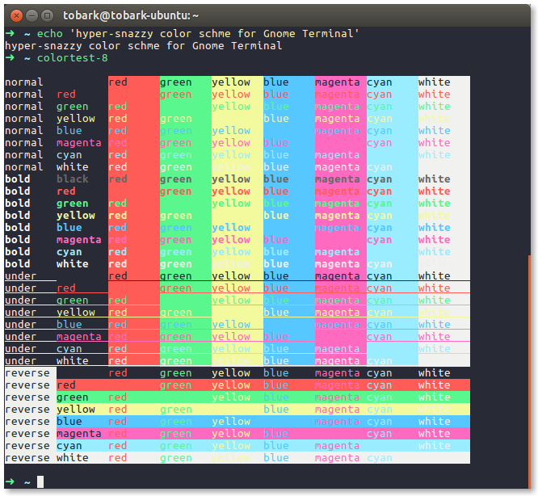
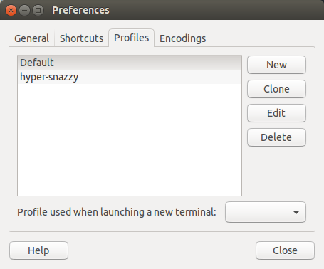

# hyper-snazzy-gnome-Terminal

> hyper-snazzy color scheme for Gnome Terminal
Color scheme from [hyper-snazzy](https://github.com/sindresorhus/hyper-snazzy)

## Install

Simply `chmod +x hyper-snazzy.sh && ./hyper-snazzy.sh`. it will add hyper-snazzy profile.

